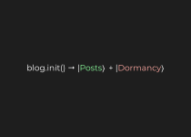

Hello future reader! The human currently editing this markdown document (which is then rendered as html thanks to some nifty tech) is me! Who's "me"? Well, I go by the name of Sid!

I am an anonymous yet public guy who's addicted to anything he finds interesting. What do I find interesting as of now? Well, it's primarily Physics, Math, CS and all in between (and sometimes not 🤷)!

> Sorry biology and related fields. You don't get a cut...

My blog, **GIA** (pronounced like *Guy-a*) is supposed to be a way for me to document myself - my thoughts, stuff that entice me and suchlike. It's supposed to cover two main classes of things:

- Educational Stuff
- Me!

> GIA = Generally an Information Arsenal. The more you know!

# The journey so far

{:data-zoomable="" .centered-image}

Alright, so the guy aka Sid aka me is pretty lazy at times. Sometimes he's struggling through something, or well he's just looking for excuses. At times, he's extremely dedicated and that's when the real stuff happened. I created the blog with the sole purpose of learning about Jekyll and GitHub Pages. This want for knowledge evolved into a want for sharing knowledge with my next few posts. Up next, I decided my blog with almost no readers (as of now, but that's definitely gonna change!) should have a way for people to comment (which is fully functional right now - well not really, but it works for the most part 😅)

> **pERfEcTIOniST Sid:** IT'S GOING TO BE FULLY FUNCTIONAL WHEN I AM SATISFIED AIGHT?

# Before you go

So yep. GIA's the digital embodiment of Sid - well kinda. It's not supposed to informationally exhaustive, but it's not supposed to be the complete either. A sweet spot where you have information and casual talk all combined into the richness of some beautiful text and images on the web.

GIA's not perfect. And it'll never be. If you find any bugs, it'll be much appreciated if you let me know using the comments for example.

Thanks for showing interest in an about me hidden deep (just play along) in here. I hope you enjoy!
